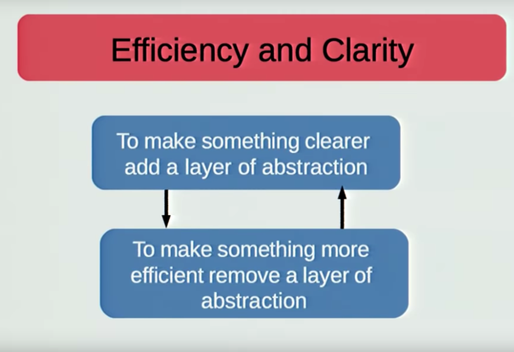

slidenumbers: true
autoscale: true
theme: work

# [fit] Functional Programming in Scala 
# and Why We Should Care

---

## Agenda

1. Our high-level goals
1. Abstraction
  * Including personal musings
1. Patterns in creating abstractions
  * Pure functions
  * Polymorphism
  * Ad-hoc polymorphism and type classes
1. Cats library
  * Higher order types
  * Examples of type classes
1. Deeper dive into code (informal)
  * Kafka consumption
  * API

---

## Our Goal

**Ship quality code**

This means code that:

* Is easy to test
* Is easy to re-use
* We can write quickly
* Provides a useful abstraction
* Handles failure by design
* Scales well, is performant, and robust (Akka solves this for us)

---

## Abstraction

*A re-usable dimensionality reduction in a problem space*

Are the **holy grail** in programming; they allow for thinking about a problem in isolation, without worrying about other components.

With powerful abstractions, applications focus on the business logic, and the "glue" between the abstractions.

---

## Square-Cube Law

Analogy: [Square-Cube Law](https://en.wikipedia.org/wiki/Square%E2%80%93cube_law): As the size *($$n$$)* of an object increases, its *surface area* increases at *$$O(n^2$$)*, while its *volume* increases at *$$O(n^3)$$*.

In our world, the *surface area* is the information we need in order to *compose* chunks. The *volume* is the information we need in order to *implement them*. Once a chunk is implemented, we only need to think about the surface area.

* FP  => surface area == function signature
* OOP => surface area == class, trait

[.footer: https://bartoszmilewski.com/2014/11/04/category-the-essence-of-composition/]

---



[.footer: "The Mess We're In" by Joe Armstrong - https://www.youtube.com/watch?v=lKXe3HUG2l4]

---

## Patterns in Creating Abstractions
[.build-lists: true]

1. Pure Functions
2. Polymorphism

---

## Patterns in Creating Abstractions - Pure Functions

In a strongly-typed language, *pure functions* are a **black box abstraction**:

* Only need to understand the parameters and the return type
* Has no "side effects"
* If you want to be pedantic, you could point out that no function is a true black box (time, effects on hardware, energy usage, etc.)
* The point is that for **most** uses, you can think of pure functions as a black box; implementation does not matter

---

## Patterns in Creating Abstractions - Polymorphism
[.build-lists: true]

*Polymorphism*: re-using a single interface on many concrete types, or using a single abstract type to represent many concrete types that follow some contract.


Comes in three main forms:

1. **Subtype Polymorphism**: Class inheritance (`class X extends Y`). Algebraic data types are especially helpful here (`sealed`).
2. **Parametric Polymorphism**: Generics (`List[A]`). Specify generic code to run on various types.
3. **Ad-Hoc Polymorphism**: Similar to parametric polymorphism, but more generalizable. Change the generic code based on the actual type used.

[.footer:  http://eed3si9n.com/herding-cats/polymorphism.html & https://dzone.com/articles/scala-ad-hoc-polymorphism-explained ]

---

## Ad-hoc Polymorphism

* Provide separate functions for different types of `A`, that extend some *Type Class*
* Works without access to source code (`Int`, `Source`, etc)
* Can be enabled and disabled in different scopes
* Can have multiple implementations for the same type

[.footer:  http://eed3si9n.com/herding-cats/polymorphism.html]

---

## Ad-hoc Polymorphism - Type Classes

The most common and powerful example of ad-hoc polymorphism is the use of Type Classes.

*Type Class*: An interface that defines a behavior.

[.footer:  http://learnyouahaskell.com/types-and-typeclasses]

---

## Type Classes vs. Traditional Subtype Polymorphism

Example: Taking a shared data type and serializing into JSON

---

## Type Classes vs. Traditional Subtype Polymorphism

Object Oriented Approach

```scala
trait Serializable {
  def toJson: String
}

case class Shared(name: String, timeCreated: DateTime)
  extends Serializable {
  def toJson: String = ???
}
```

---

## Type Classes vs. Traditional Subtype Polymorphism

Type Class Approach

```scala
case class Shared(name: String, timeCreated: DateTime)

trait CanSerialize[A] {
  def toJson(in: A): String
}

implicit val SharedEpochSer = new CanSerialize[Shared] {...}
implicit val SharedRfcSer   = new CanSerialize[Shared] {...}
```

---

## Type Classes vs. Traditional Subtype Polymorphism

Type Classes *separate class definition* from its *behavior*.

Separating these two allows all applications to share the same *class definition*, but select *which serializer* to use when needed.

Type Classes often *compose*, meaning if you have a type class for `A`, you automatically have a type class for `Option[A]`, `Map[?, A]`, etc.

---

## Combining Functional Programming and Polymorphism

By using and creating libraries built around Functional Programming and Polymorphism, we can:

* Separate data types from behaviors
* Build components that all behave similarly
* Reason about our components in isolation
* Combine components together with minimal boilerplate (Type Classes + Cats)

---

## Cats


* Built by [TypeLevel](https://typelevel.org/)
* Top notch documentation with a helpful community
  * Great interactive tutorial from [scala-exercises](https://www.scala-exercises.org/cats)
* Modular library
* **Many** libraries built around it
* Built upon *Category Theory* (hence the name)
  * Mathematically grounded study of abstract structures
* Provides many Type Classes, and extensive tooling around them

---

## Cats Type Class Example

[.code-highlight: 12]
[.code-highlight: 4-11]
[.code-highlight: 14-18]

```scala
import cats._
import cats.implicits._

object CommittableElement {
  implicit val functor = new Functor[CommittableElement] {
    override def map[A, B](fa: CommittableElement[A])(f: A => B): CommittableElement[B] = {
      CommittableElement(fa.committableOffset, f(fa.element))
    }
  }
}

case class CommittableElement[A](committableOffset: CommittableOffset, element: A)

object Main extends App {
  functor.map(CommittableElement(offset, 5))(_ + 1)
  CommittableElement(offset, 6).map(_ + 1)
}
```

---

## Example Continued

```scala
def greet(str: String): Either[Error, String] = {
  if (str.contains("boom")) Left(Error("boom"))
  else Right(s"$str world")
}

val nestedHello = CommittableElement(offset, Either.right[Error, String]("hello"))
val nestedBoom = CommittableElement(offset, Either.right[Error, String]("boom"))

EitherT(nestedHello).subflatMap(greet).map(_.toUpperCase)
// CommittableElement(offset, Right("HELLO WORLD"))

EitherT(nestedBoom).subflatMap(greet).map(_.toUpperCase)
// CommittableElement(offset, Left(Error("boom")))
```

---

## Higher-Order types (Higher-Kinded types)

**Proper**
```
Int             String          Car         HttpRequst
```
**First-Order**
```
List[A]         Option[A]       Either[L, R]            Flow[A, B, M]
Ordering[A]     Monoid[A]       Show[A]
```
**Higher-Order**
```
Functor[F[_]]   Monad[F[_]]     Bifunctor[F[_, _]]
```

> Concretely, a higher-order abstraction abstracts over something that abstracts over something
- Aadrian Moors

[.footer: https://stackoverflow.com/questions/6246719/what-is-a-higher-kinded-type-in-scala/6427289#6427289]

---

## Type Class Examples (Cats) - Semigroup

```scala
trait Semigroup[A] {
  def combine(x: A, y: A): A
}
```

[.footer: https://typelevel.org/cats/typeclasses.html]

---

## Type Class Examples (Cats) - Monoid

```scala
trait Monoid[A] extends Semigroup[A] {
  def empty: A
}
```

[.footer: https://typelevel.org/cats/typeclasses.html]

---

## Type Class Examples (Cats) - Functor

```scala
trait Functor[F[_]] {
  def map[A, B](fa: F[A])(f: A => B): F[B]
}
```

[.footer: https://typelevel.org/cats/typeclasses.html]

---

## Type Class Examples (Cats) - Monad

```scala
trait Monad[F[_]] extends Functor[F]{
  def pure[A](a: A): F[A]
  def flatMap[A, B](fa: F[A])(f: A => F[B]): F[B]
  def map[A, B](fa: F[A])(f: A => B): F[B] = ???
}
```

[.footer: https://typelevel.org/cats/typeclasses.html]

---

## Type Class Examples (Cats) - Monad

```scala
trait Monad[F[_]] extends Functor[F]{
  def pure[A](a: A): F[A]
  def flatMap[A, B](fa: F[A])(f: A => F[B]): F[B]
  def map[A, B](fa: F[A])(f: A => B): F[B] =
    flatMap(fa)(a => pure(f(a)))
}
```

[.footer: https://typelevel.org/cats/typeclasses.html]

---

## Kafka Example

---

## API Example

